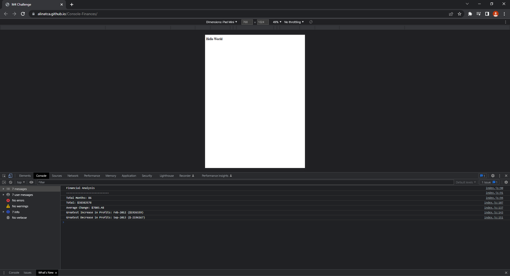

# Description

Console Finances challenge was a very difficult project where we had different request based on arrays with 2 fields Dates and Proift/Losses. 

I had to write the code to identify the total number of the months, the total amount of the entire period, the average of the changes in both profit and losses and also the greatest increase and decrease in profit and losses over the entire period. 

# Challenges

This project was a really hard one for me, as is my first time dealing with Javascript by my own. I had to do a lot of research, spend a lot of time understand what everything means and how I can apply what I've seen on Google to my list of tasks. 

Here is the live URL: https://alinatca.github.io/Console-Finances/

Preview the console below: Preview the console below: 

# Things I learned

Working with Javascript at my level was not easy, however I am proud to get this chanllege done and learn so many things by doing a lot of mistakes. 

# Contact

You can reach me at:

Github: [GitHub](https://github.com/alinatca)
Email: alina_tca@yahoo.com
Linkedin: [LinkedIn Profile](https://www.linkedin.com/in/alina-tudor-7a1047168/)
# console-finances
